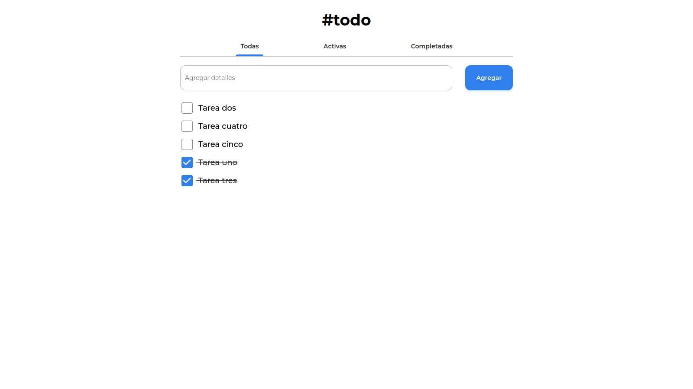
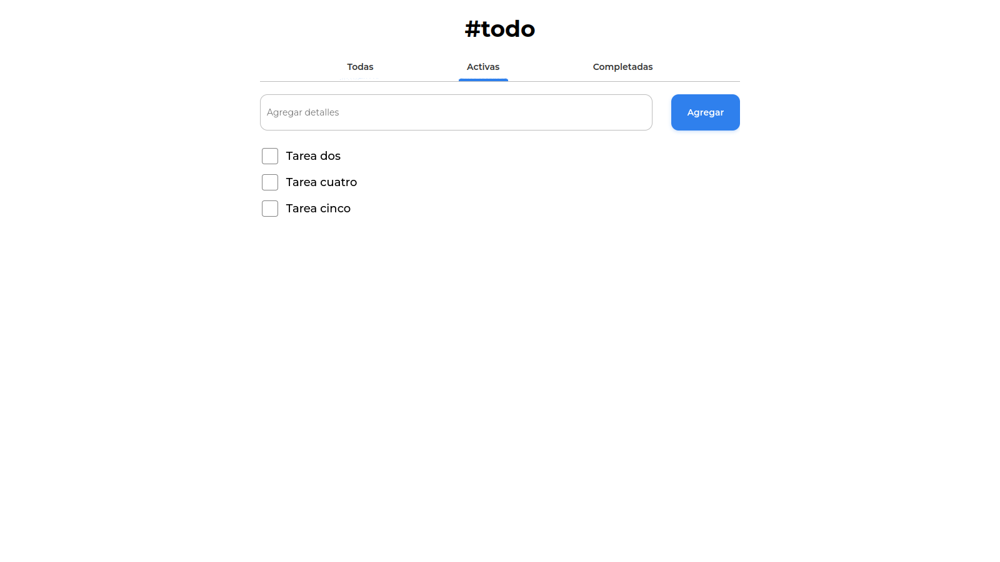
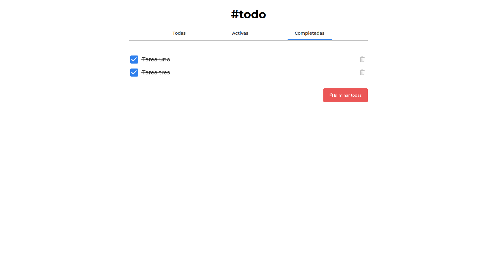
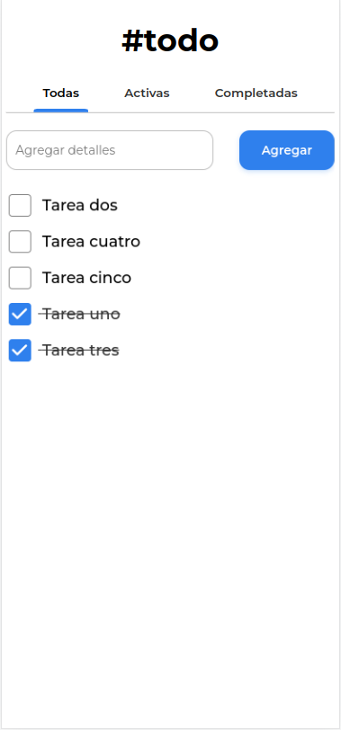
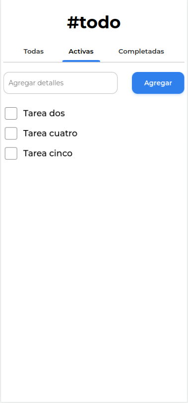
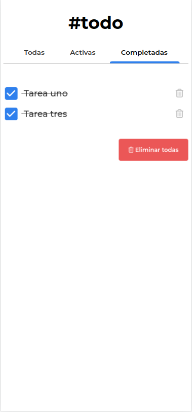

<!-- Please update value in the {}  -->

<h1 align="center">Aplicación #todo | #todo App</h1>

<div align="center">
  Solución para un desafío de <a href="https://devchallenges.io" target="_blank">Devchallenges.io</a> | Solution for a challenge from  <a href="https://devchallenges.io" target="_blank">Devchallenges.io</a>.
</div>

<div align="center">
  <h3>
    <a href="https://javiervaleriano.github.io/devchallenge-todo-app">
      Demo
    </a>
    <span> | </span>
    <a href="https://devchallenges.io/solutions/dLIZjm5PzCfzwD1ZqOts">
      Solución / Solution
    </a>
    <span> | </span>
    <a href="https://devchallenges.io/challenges/hH6PbOHBdPm6otzw2De5">
      Desafío / Challenge
    </a>
  </h3>
</div>

<!-- TABLE OF CONTENTS -->

## Table of Contents

- [Visión general | Overview](#visi%C3%B3n-general--overview)
  - [Construido con | Built With](#construido-con--built-with)
- [Características | Features](#caracter%C3%ADsticas--features)
- [Cómo usar | How to use](#c%C3%B3mo-usar--how-to-use)
- [Contacto | Contact](#contacto--contact)

<!-- OVERVIEW -->

## Visión general | Overview

### Escritorio | Desktop





### Móvil | Mobile





**lang="es"**: Hola, persona que está viendo mi proyecto :) Este proyecto lo desarrollé con TypeScript y me gustó mucho porque pude mejorar mi entendimiento y mi habilidad con este superset de JS. Específicamente, pude mejorar mi habilidad con las interfaces. Respecto a la lógica empleada para cumplir con el desarrollo, lo único que se me complicó fue la actualización del localStorage con las tareas al momento de eliminar todas voluntariamente, pero finalmente lo logré hacer :D

**lang="en"**: Hello, person who is watching my project :) I developed this project with TypeScript and I really liked it because I was able to improve my understanding and skill with this JS superset. Specifically, I was able to improve my skill with interfaces. Regarding the logic used to accomplish the development, the only thing that was complicated for me was the update of the localStorage with the tasks at the time of deleting all of them voluntarily, but finally I managed to do it :D

### Construido con | Built With

<!-- This section should list any major frameworks that you built your project using. Here are a few examples.-->

- [React](https://reactjs.org/)
- [TypeScript](https://www.typescriptlang.org/)

## Features

<!-- List the features of your application or follow the template. Don't share the figma file here :) -->

**lang="es"**: Esta aplicación/sitio fue creada como una presentación a un desafío de [DevChallenges](https://devchallenges.io/challenges). El [reto](https://devchallenges.io/challenges/hH6PbOHBdPm6otzw2De5) consistía en construir una aplicación para completar las historias de usuario dadas:

**lang="en"**: This application/site was created as a submission to a [DevChallenges](https://devchallenges.io/challenges) challenge. The [challenge](https://devchallenges.io/challenges/hH6PbOHBdPm6otzw2De5) was to build an application to complete the given user stories:

- User story: Puedo agregar una nueva tarea | I can add a new task
- User story: Puedo completar una tarea | I can complete a task
- User story: Puedo alternar entre Todas, Activas y Completadas | I can toggle between All, Active and Completed
- User story: Puedo eliminar una o todas las tareas en la pestaña de Completadas | I can remove one or all tasks under the Completed tab
- User story (optional): Almacena los datos en el Almacenamiento Local para que cuando actualice la página pueda seguir viendo mi progreso | Store the data in local storage that when I refresh the page I can still see my progress.

## Cómo usar | How To Use

<!-- Example: -->

Para clonar y ejecutar esta aplicación, necesitarás [Git](https://git-scm.com), [Node.js](https://nodejs.org/en/download/) (que viene con [npm](https://www.npmjs.com/)) y [TypeScript](https://www.typescriptlang.org/) instalados en tu ordenador. Desde tu línea de comandos:

```bash
# Clona este repositorio
$ git clone https://github.com/javiervaleriano/devchallenge-todo-app

# Instala las dependencias
$ npm install

# Ejecuta la aplicación
$ npm start
```

To clone and run this application, you'll need [Git](https://git-scm.com) and [Node.js](https://nodejs.org/en/download/) (which comes with [npm](https://www.npmjs.com/)), and [TypeScript](https://www.typescriptlang.org/) installed on your computer. From your command line:

```bash
# Clone this repository
$ git clone https://github.com/javiervaleriano/devchallenge-todo-app

# Install dependencies
$ npm install

# Run the app
$ npm start
```

## Contacto | Contact

- [Sitio web | Website](https://javiervaleriano.github.io/javiervaleriano-portfolio)
- Codepen: [@javiervaleriano](https://codepen.io/javiervaleriano)
- [Devchallenges.io](https://devchallenges.io/portfolio/javiervaleriano)
- GitHub: [@javiervaleriano](https://github.com/javiervaleriano)
- Twitter: [@javaleriano2](https://twitter.com/javaleriano2)
